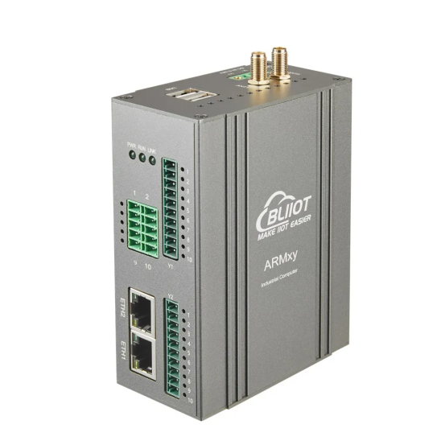
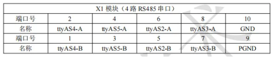
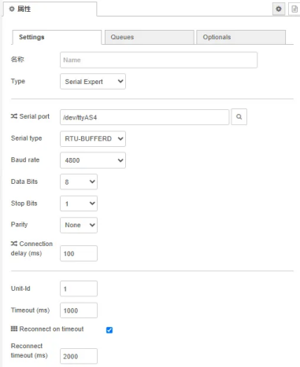
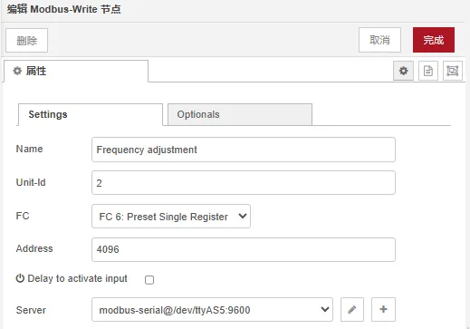
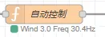

# Node-RED 本地离线风速联动风扇控制

## 1 前言

### 1.1 简介

本方案基于BL118边缘计算网关，打造一套集风速数据采集、本地逻辑PID闭环控制的轻量化智能风速控制系统。



系统依托网关RS485工业接口接入风速传感器与变频器，在边缘端完成全自主风速闭环调控。

### 1.2 实现效果

- 自动采集现场实时风速，数据防抖滤波，数值稳定
- PID 动态调节变频器频率，自动稳速
- 全程本地离线运行

### 1.3 整体流程


## 2 设备清单

- RS485风速传感器（Modbus RTU）
- 风扇+变频器（支持Modbus RTU频率设定）
- ARMxy（预装Node-RED）

## 3 分步搭建

根据不同的X/Y 板，有不同的串口可选择。

本方案基于BL118板载X1模块的ttyAS4和ttyAS5端口来连接设备，实现风速数据采集与变频器控制，设备的通信参数需根据设备手册进行配置。



### 3.1 配置风速采集节点



### 3.2 配置核心自动控制Function节点

#### 核心控制完整代码

```js
// CONFIG
const TARGET_WIND = 4.0;
const DEAD_BAND = 0.2;
const WIND_SCALE = 10;
const FREQ_MIN = 5;
const FREQ_MAX = 50;
const KP = 5.0, KI = 0.1, KD = 0.3;

if (context.windBuffer === undefined) context.windBuffer = [];
if (context.last_error === undefined) context.last_error = 0;
if (context.integral === undefined) context.integral = 0;

// 1. 滤波
let raw_wind = msg.payload;
let real_wind = raw_wind / WIND_SCALE;
context.windBuffer.push(real_wind);
if (context.windBuffer.length > 5) context.windBuffer.shift();
let filter_wind = context.windBuffer.reduce((a, b) => a + b, 0) / context.windBuffer.length;
flow.set("wind_speed", filter_wind);

// 2. 策略层：风大 → 最低转速
if (filter_wind > TARGET_WIND + DEAD_BAND) {
    context.integral = 0;
    context.last_error = 0;
    let reg_min = FREQ_MIN * 200;
    node.status({ fill: "blue", text: `Wind ${filter_wind.toFixed(1)} - Min Speed` });
    return { payload: reg_min };
}

// 3. PID 调速层：风小 → 主动补风
if (filter_wind < TARGET_WIND - DEAD_BAND) {
    let error = TARGET_WIND - filter_wind;
    context.integral += error;
    context.integral = Math.max(-200, Math.min(200, context.integral));
    let derivative = error - context.last_error;
    let output = KP * error + KI * context.integral + KD * derivative;

    context.last_error = error;

    let target_freq = 25 + output;
    target_freq = Math.max(FREQ_MIN, Math.min(FREQ_MAX, target_freq));
    let reg_value = Math.round(target_freq * 200);
    node.status({ fill: "green", text: `Wind ${filter_wind.toFixed(1)} Freq ${target_freq.toFixed(1)}Hz` });
    return { payload: reg_value };
}

// 4. 稳态区：风速在目标±死区内 → 保持最低转速
let reg_min = FREQ_MIN * 200;
node.status({ fill: "gray", text: `Wind ${filter_wind.toFixed(1)} - Steady` });
return { payload: reg_value };
```

### 3.3 添加变频输出写入节点



## 4 功能说明

### 4.1 数据滤波

由于传感器数据可能存在波动，系统会自动取最近5次数据的平均值作为实际风速。这样可以避免瞬时干扰导致风机频繁调速。

### 4.2 自动调速功能

系统会根据当前风速自动调整风机转速：

- 风速低于目标值 → 自动提高转速  
- 风速高于目标值 → 自动降低转速  
- 风速接近目标值 → 保持稳定

### 4.3 风速保护机制

当风速超过安全范围（如8m/s）时，系统自动停止输出。

### 4.4 PID自动调节

系统使用PID算法实现连续调节，使风速逐步接近目标值。相比传统开关控制，PID可以避免风速忽高忽低的问题。

### 4.5 离线运行

所有控制逻辑在本地设备完成，断网完全不影响运行。

## 5 常见问题

| 故障现象 | 排查解决方法 |
| --- | --- |
| 无风速数据采集 | 核对端口、寄存器地址、从站等配置 |
| 风扇不调速、无动作 | 1.核对端口、寄存器地址、从站等配置<br>2.检查风速缩放系数 |

## 6 运行验证

部署完成后，满足以下状态即为运行正常：

- 节点状态栏正常刷新，实时显示风速与输出频率
- 断开网络后，控制逻辑完全正常运行



## 7 总结

本案例实现了一套基于Node-RED的本地离线风速自动控制系统。

通过数据滤波、PID自动调节和安全保护机制，实现风速的稳定控制，同时保证系统在工业现场环境下可靠运行。

## 售后支持：0755-29451836
