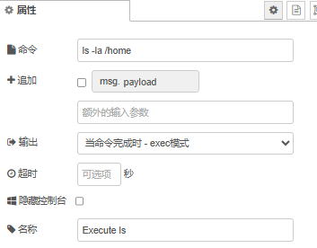
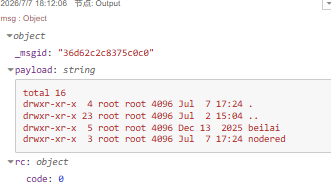
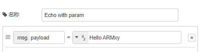
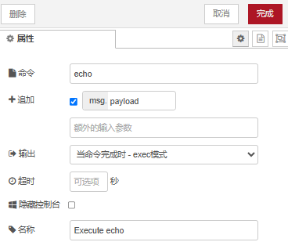
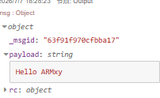
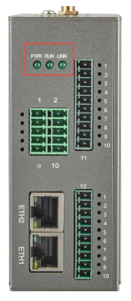
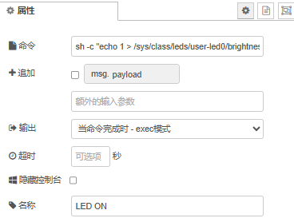
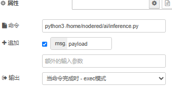
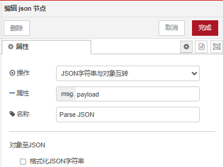
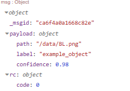

# Node-RED Exec节点使用教程

## 1. 简介

Node-RED内置的Exec节点可以在流程中直接执行系统命令，并将结果用于后续处理。这为集成Linux命令、控制硬件、调用外部脚本提供了极大的灵活性。

本次教程使用BL118，将演示以下内容：

1. 执行 `ls`、`echo` 等基础命令，理解固定参数与动态参数传递
2. 控制ARMxy板载LED的亮灭
3. 调用Python脚本并解析其返回的JSON结果
4. 安全使用Exec节点的注意事项

## 2. 环境准备

- ARMxy设备
- Node-RED启动，可通过浏览器访问编辑器

## 3. 第一部分：基础命令ls与echo

### 3.1 执行ls查看目录

**流程结构**


**操作步骤**

1. 从节点面板拖入Inject节点，双击编辑，命名为`ls /home`，`msg.payload`留空。
2. 拖入Exec节点，双击配置：



3. 拖入Debug节点，连接Exec节点的第一个输出。
4. 点击部署，然后单击Inject节点的按钮，在右侧调试窗口即可看到`/home`目录下的文件列表。



### 3.2 使用echo动态传参

**流程结构**


（注：原文提及“流程结构”，但未提供图形或详细节点配置说明）

**操作步骤**

1. 添加一个Inject节点，命名为`Echo with param`，将`msg.payload`设置为字符串`Hello ARMxy`。



2. 添加一个Exec节点，配置：



3. 连接Debug节点并部署。点击按钮，调试窗口会输出`Hello ARMxy`。



这种方式让命令变得动态——相同的Exec节点可以根据上游消息执行不同的操作（如控制不同的文件、传递不同的参数等），是实现复杂自动化的基础。

## 4. 第二部分：控制BL118板载LED灯

### 4.1 硬件说明

以下是BL118的LED指示灯说明：



LED指示灯如图,从左至右的顺序为LED2、LED1、LED0。其中LED2为 

POWER 指示灯，上电后电源正常时常亮；LED1为RUN灯，系统正常运行时闪烁；LED0为LINK灯，使用有线网络连接互联网时常亮，4G或WiFi时闪烁。 

#### 查看触发条件

可通过以下命令查看当前LED0的触发模式：

```bash
cat /sys/class/leds/user-led0/trigger
```

输出示例：

```
[none] rc-feedback mmc0 mmc1 mmc2 timer oneshot heartbeat backlight gpio 
cpu0 cpu1 cpu2 cpu3 default-on transient
```

其中 `[none]` 表示当前led0的触发条件为无。向 `trigger` 文件写入上述字符串之一，可以修改触发条件。

当LED触发条件设置为 `none` 时，可通过命令手动控制亮灭：

- **控制LED0亮起**：
  ```bash
  echo 1 > /sys/class/leds/user-led0/brightness
  ```

- **控制LED0熄灭**：
  ```bash
  echo 0 > /sys/class/leds/user-led0/brightness
  ```

- **控制LED1熄灭**：
  ```bash
  echo 0 > /sys/class/leds/user-led1/brightness
  ```

### 4.2 创建开关灯流程

**流程结构**


**操作步骤**

1. 创建开灯Inject节点，`msg.payload`设为数字`1`（仅作标记，实际命令不依赖它）。
2. 创建开灯Exec节点，命令填写：



4. 同理创建关灯流程，命令中的`1`改为`0`：
   ```bash
   echo 0 | sudo tee /sys/class/leds/user-led0/brightness
   ```
5. 部署后，点击LED ON按钮，LED亮起；点击LED OFF，LED熄灭。

## 5. 第三部分：调用Python脚本

Exec节点可以调用任何可执行脚本，并捕获其标准输出。下面演示如何通过Python脚本模拟图像推理，并解析JSON结果。

### 5.1 创建Python脚本

在终端执行以下命令创建脚本目录和文件：

```bash
mkdir -p /home/nodered/ai
vi /home/nodered/ai/inference.py
```

写入以下内容：

```python
#!/usr/bin/env python3

import sys, json

if len(sys.argv) < 2:
    result = {"error": "Missing image path"}
else:
    img_path = sys.argv[1]
    # 模拟推理结果，未来可替换为真实模型
    result = {
        "path": img_path,
        "label": "example_object",
        "confidence": 0.98
    }

print(json.dumps(result))
```

保存后赋予执行权限：

```bash
chmod +x /home/nodered/ai/inference.py
```

**手动测试脚本**：

```bash
python3 /home/nodered/ai/inference.py /data/BL.png
```

预期输出：

```json
{"path": "/data/BL.png", "label": "example_object", "confidence": 0.98}
```

### 5.2 创建Node-RED调用流程

**流程结构**


**操作步骤**

1. 添加Inject节点，命名为`Call Python Script`，`msg.payload`设为图片路径，如`/data/BL.png`。


2. 添加Exec节点，配置：



3. 添加JSON节点（位于“解析”分类下），属性保持默认`msg.payload`，用于将脚本输出的字符串转换为对象。



4. 连接Debug节点，命名为`Inference Result`。
5. 部署并点击Inject按钮，调试窗口应显示解析后的对象：



## 6. 安全提示

使用Exec节点执行系统命令存在潜在风险，尤其是在生产环境中。以下是关键的安全实践建议：

1. **二次确认机制**
对危险命令（如reboot、shutdown）必须在流程中加入确认机制（如Dashboard弹窗或延迟触发）。

2. **定期审计与清理**
检查所有Exec节点的命令，删除闲置节点，保持Node-RED更新

## 7. 总结

可以基于这些示例，扩展出更复杂的自动化应用，例如定时采集传感器数据、远程控制外设、集成真正的AI推理模型等。  

## 售后支持：0755-29451836
