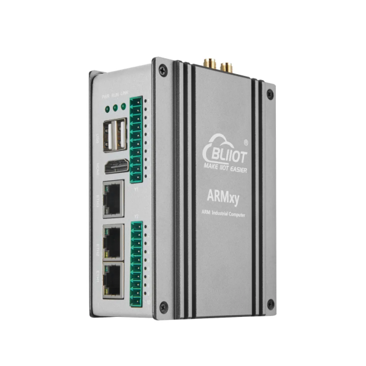
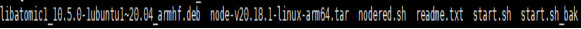
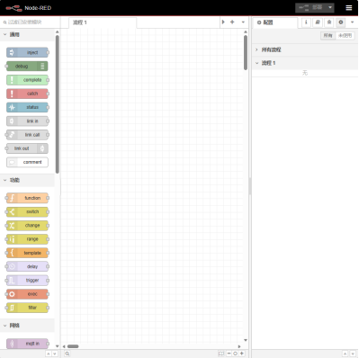
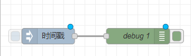
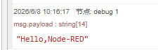

# 快速装好Node-RED，在ARMxy上跑通你的第一个节点

## 一、 确认设备已预装 Node-RED

本次演示基于 ARMxy BL340 设备进行演示。



### 1. 登录设备终端，执行以下命令检查是否预装：

   ```bash
   node-red -v
   ```

   若提示 `command not found`，先完成 Node-RED 安装。

### 2. 上传安装包到设备

   通过 scp 或 tftp 工具将官方提供的安装包上传至设备的 `/usr/local/bin` 目录:

   ```bash
   scp node-red_64bit.zip root@设备IP:/usr/local/bin/
   ```

## 二、安装包解压与部署

### 1. 进入到上传目录，解压安装包：

   ```bash
   unzip node-red_64bit.zip
   ```


### 2. 进入目录，在目录里安装依赖库并解压 Node.js 运行环境

   ```bash
   dpkg -i libatomic1_10.5.0-1ubuntu1~20.04_armhf.deb
   tar -xf node-v20.18.1-linux-arm64.tar
   ```

### 3. 配置系统环境

   ```bash
   echo "export PATH=/usr/local/bin/node-red_64bit/node-v20.18.1-linux-arm64/bin:\\$PATH" >> /etc/profile
   source /etc/profile
   ```

### 4. 验证 Node 环境是否生效

   ```bash
   node -v
   npm -v
   ```

   出现版本号即配置成功。

### 5. 启动 node-red

   ```bash
   node-red
   ```

   浏览器访问 `http://设备ip:1880` 开始编辑。

## 三、编辑器界面导览

Node-RED 编辑器分为三个核心区域：

| 区域 | 功能说明 |
| --- | --- |
| 左侧：节点库 | 内置了大量可拖拽的功能节点(如输入，输出、函数、物联网协议等)，按分类排列 |
| 中间：工作区 | 拖拽节点、连接节点、搭建业务流程的画布区域 |
| 右侧：信息面板 | 查看流程运行日志、节点输出<br>Debug：查看选中节点的配置与说明<br>上下文面板：查看/管理流程变量与全局变量<br>配置面板：编辑器全局配置、节点管理 |



## 四、创建第一个流程

### 步骤 1：拖拽节点

1. 在左侧节点库中，找到 inject 节点，拖拽到中间工作区。
2. 找到 debug 节点，拖拽到 inject 节点的右侧。

### 步骤 2：连接节点

将鼠标指针移动到 inject 节点的右侧，按住左键拖动到 debug 节点的左侧，松开鼠标完成连接。



### 步骤 3：配置节点

1. 双击 inject 节点，打开配置面板:
    - 将「Payload」类型修改为 `string`
    - 输入 `Hello, Node-RED`
    - 点击「完成」保存配置。


2. debug 节点默认配置无需修改，会直接输出所有收到的消息。

### 步骤 4：运行并查看输出

1. 点击编辑器右上角的红色「部署」按钮，将流程保存到设备并启动。
2. 点击 inject 节点左侧的蓝色按钮（触发按钮），手动触发一次流程。
3. 打开右侧 Debug 面板，即可看到 debug 节点输出的消息内容。



## 五、导出流程

点击编辑器右上角的菜单按钮，选择导出，即可保存为 json 格式 Demo.

```json
[
  {
    "id": "7e82b0e46aa45852",
    "type": "tab",
    "label": "流程 1",
    "disabled": false,
    "info": "",
    "env": []
  },
  {
    "id": "bb7092fcf4d6c569",
    "type": "inject",
    "z": "7e82b0e46aa45852",
    "name": "",
    "props": [
      {
        "p": "payload"
      },
      {
        "p": "topic",
        "vt": "str"
      }
    ],
    "repeat": "",
    "crontab": "",
    "once": false,
    "onceDelay": 0.1,
    "topic": "",
    "payload": "Hello,Node-RED",
    "payloadType": "str",
    "x": 160,
    "y": 220,
    "wires": [
      [
        "7efa7c99c98594b2"
      ]
    ]
  },
  {
    "id": "7efa7c99c98594b2",
    "type": "debug",
    "z": "7e82b0e46aa45852",
    "name": "debug 1",
    "active": true,
    "tosidebar": true,
    "console": false,
    "tostatus": false,
    "complete": "false",
    "statusVal": "",
    "statusType": "auto",
    "x": 340,
    "y": 220,
    "wires": []
  }
]
```
## 售后支持：0755-29451836
