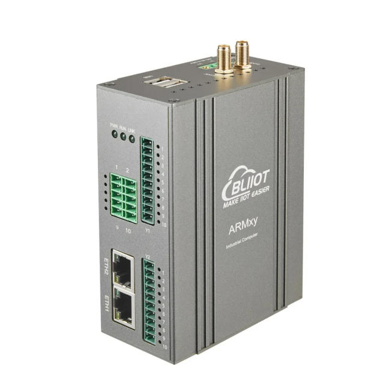
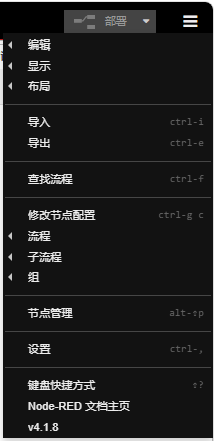
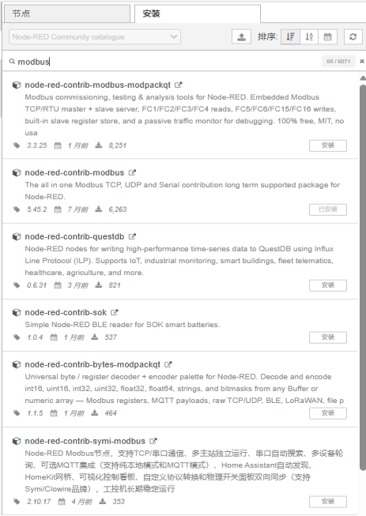
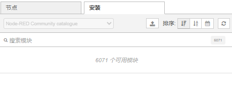

# Node-RED常用功能节点盘点及社区节点安装

## 一、文档概述

本文档基于功能分类，盘点 Node-RED 平台最常用的核心基础节点，涵盖输入、输出、处理、存储四大核心类别，明确每个节点的典型使用场景，同时详细说明平台节点管理功能的社区节点安装流程，为物联网数据流编排、设备数据交互、数据处理及存储运维提供标准化参考。

 
## 二、常用核心节点分类及场景说明

### （一）输入类节点

输入类节点主要负责采集、接收外部设备、网络、总线及消息平台的原始数据，是数据流的入口节点，为后续数据处理提供数据源。

1. **Inject 注入节点**

   典型场景：作为流程触发源，用于手动点击触发流程、定时周期性触发任务（如每分钟采集一次设备数据）、开机自动执行初始化流程，是调试和自动化定时任务的核心入口。

2. **TCP/UDP input 网络输入节点**

   典型场景：监听局域网或外网设备的TCP、UDP 协议数据，接收网络设备、上位机、第三方系统推送的报文数据，实现网络设备与Node-RED 流程的数据对接。

3. **串口 input 串口输入节点**

   典型场景：对接串口设备（传感器、单片机、PLC、串口仪表等），实时接收串口总线传输的原始硬件数据，实现硬件设备数据的采集接入。

4. **MQTT in 消息订阅输入节点**

   典型场景：订阅MQTT 服务器指定主题，接收物联网终端设备上报的消息数据，是物联网平台设备数据接入、云端设备通信的核心节点。

### （二）输出类节点

输出类节点负责将流程处理后的数据流输出、展示、下发至设备、网络、消息平台，实现数据落地和指令下发。

1. **Debug 调试输出节点**

   典型场景：实时打印流程中的数据、报文、变量信息到调试控制台，用于流程调试、数据校验、故障排查，是日常开发最常用的日志输出节点。

2. **TCP/UDP output 网络输出节点**

   典型场景：将处理完成的指令、数据通过TCP、UDP 协议发送至指定IP 和端口的设备或系统，实现网络设备的远程指令下发和数据推送。

3. **串口 output 串口输出节点**

   典型场景：向串口连接的单片机、PLC、执行器等硬件设备下发控制指令、参数配置数据，实现硬件设备的远程控制和参数调试。

4. **MQTT out 消息发布输出节点**

   典型场景：将流程处理后的设备状态、控制指令、告警信息发布到MQTT 服务器指定主题，供终端设备、云端平台订阅接收，实现物联网双向通信。

### （三）处理类节点

处理类节点是流程核心运算单元，负责对原始数据进行分支判断、逻辑运算、格式转换、延时控制、数据筛选等二次加工。

1. **Switch 分支判断节点**

   典型场景：根据数据数值、状态、关键词等条件进行多分支判断，实现流程分流，例如根据设备温度数值区分正常、预警、告警三种业务分支。
   

3. **Function 自定义函数节点**

   典型场景：通过编写JavaScript 自定义代码，实现复杂数据运算、数据解析、变量定义、自定义逻辑处理，适配标准化节点无法满足的个性化业务需求。

5. **Change 数据修改节点**

   典型场景：快速修改、新增、删除、重命名报文对象中的字段，转换数据格式、替换指定内容，无需编写代码即可完成常规数据规整。

6. **Template 模板渲染节点**

   典型场景：按照自定义模板格式化数据，将零散数据拼接为JSON、字符串、报文协议格式，适配设备通信、数据上报的格式要求。

7. **Delay 延时节点**

   典型场景：控制数据流的传输延时，实现指令延时下发、流程时序控制，也可用于防抖、限流，避免高频数据频繁触发业务流程。

8. **Filter 数据过滤节点**

   典型场景：筛选符合条件的有效数据，过滤空数据、异常数据、重复数据、无效报文，保证后续业务流程只处理合规数据。
   

### （四）存储类节点

存储类节点负责本地文件数据的读取、写入、监控，实现数据持久化存储和文件状态监听。

1. **Watch（文件变化）文件监听节点**

   典型场景：实时监控本地指定文件、文件夹的修改、新增、删除变化，当配置文件、日志文件更新时自动触发流程，实现文件变动自动化响应。
   

3. **read file 文件读取节点**

   典型场景：读取本地TXT、JSON、日志等各类文件的内容数据，用于加载配置参数、读取历史存储数据、解析本地离线文件。
   

3. **write file 文件写入节点**

   典型场景：将设备采集数据、运行日志、告警信息、处理结果写入本地文件，实现数据本地持久化存储、日志归档。
   

## 三、通过节点管理安装社区节点操作流程

Node-RED默认基础节点功能有限。可通过内置「节点管理」功能在线安装官方及社区开源扩展节点，丰富设备适配、数据处理、协议解析能力，具体操作步骤如下：

### 步骤1：进入节点管理界面

打开 Node-RED编辑器页面，点击页面右上角的菜单图标，在弹出的下拉菜单中选择「节点管理」，即可进入节点管理配置面板。

### 步骤2：切换安装标签页

在节点管理面板中，点击切换至「安装」标签页，系统会自动加载官方社区开源节点库。

### 步骤3：搜索目标社区节点

在页面搜索框中输入需要安装的节点包名称（如 modbus、influxdb、redis、ocr等业务节点包），搜索结果会展示对应的社区节点插件，同时显示插件介绍、版本、下载量及适配版本信息。

### 补充注意事项
- 安装社区节点需保证设备网络正常，可正常访问 Node-RED 官方插件库；
- 优先选择下载量高、更新活跃、适配当前 Node-RED 版本的节点包，避免兼容性问题；
- 若安装失败，可查看控制台日志排查依赖缺失、网络超时、版本不匹配等问题。

## 四、总结

本文盘点的核心节点覆盖 Node-RED 日常开发数据接入、指令下发、逻辑处理、数据存储全流程，是物联网流程编排的基础核心能力。同时通过节点管理功能可快速拓展社区生态节点，适配 Modbus、数据库、AI 识别、云平台对接等复杂业务场景，极大提升 Node-RED 的开发灵活性和业务适配性。

---
**售后支持**：0755-29451836
