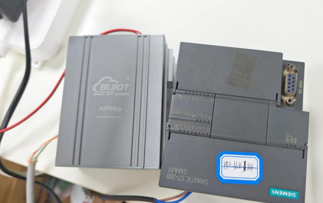
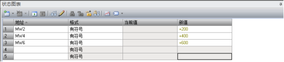
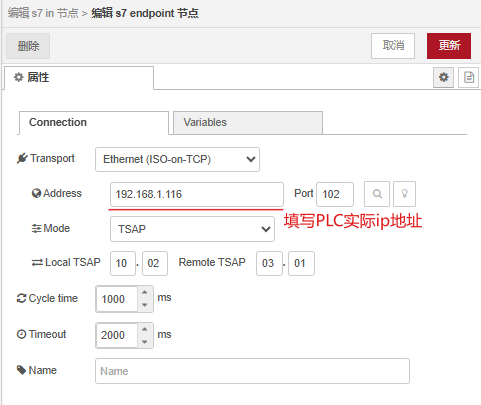
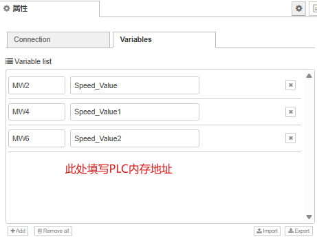
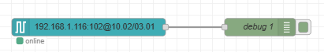
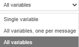
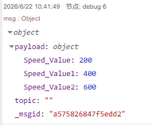

# 基于ARMxy内置Node-red平台采集西门子S7-200 SMART PLC数据实操

## 1. 概述

### 1.1 方案简介

本文档讲解基于ARMxy边缘计算网关内置 Node-RED 平台，通过S7协议（ISO-on-TCP）实现西门子S7-200 SMART PLC数据采集的完整实操流程。



S7-200 SMART PLC区别于S7-1200/1500系列PLC，不支持传统Rack/Slot通信模式，通过TSAP模式建立通信连接，是本次部署的核心关键点。

### 1.2 测试环境配置

测试环境：

| 设备/软件 | 配置 |
| --- | --- |
| PLC设备 | 西门子S7-200 SMART |
| PLC编程软件 | STEP7-Micro/WIN SMART |
| Node-RED | ARMxy内置 |
| S7通信节点 | node-red-contrib-s7 |
| 底层通信协议 | ISO-on-TCP |
| 通信连接模式 | TSAP |
| 通信端口 | 102（S7协议默认端口） |

## 2. PLC端测试数据配置

为验证Node-RED数据采集功能，需提前在PLC内创建测试变量并赋值，在STEP7-Micro/WIN SMART 编程软件，连接S7-200 SMART PLC，然后打开【状态图表】，按照图中配置,点击铅笔图标将变量写入到PLC。



## 3. Node-RED S7通信节点安装

Node-RED默认无S7协议通信节点，需手动安装官方适配插件。界面右上角菜单里点击节点管理，在安装标签页搜索node-red-contrib-s7进行安装。

安装成功后，左侧节点栏会新增3个核心节点：

s7 control：控制节点

s7 in：PLC数据读取节点

s7 out：PLC数据写入节点

## 4. S7 Endpoint核心通信参数配置

s7 endpoint是建立Node-RED与PLC通信的核心配置，所有数据读写流程均依赖该该配置的连接参数，拖入s7 in数据读取节点，双击节点进入配置界面，点击添加新的s7 Endpoint配置，按照以下参数设置。





拖入debug 调试节点，连线：s7 in节点输出端 → debug节点输入端，点击右上角【Deploy（部署）】，激活整个采集流程。



注：s7 in节点可以选择三种输出模式。



部署成功后，打开Node-RED右侧调试窗口，可实时读取PLC数据，输出结果如下：



## 5. 关键配置：禁止使用Rack/Slot模式说明

S7-1200/1500系列PLC默认采用 Rack=0、Slot=1 模式通信，但该模式不适用于S7-200 SMART。

若强行使用Rack/Slot模式，会直接导致通信异常，触发以下报错：

```
Plain Text
offline
Error: read ECONNRESET
Error: write ECONNRESET
```

报错原因：S7-200 SMART PLC底层通信协议仅支持TSAP链路握手，不兼容Rack/Slot寻址机制，所有部署场景必须固定选择 Mode=TSAP。

## 6. 常见报错问题

S7节点不支持直接识别S7-200 SMART原生V区地址（VB/VW/VD），若直接填写VW100，会立即触发：Area addressed is unknown or invalid错误。

## 7. 完整数据流转链路

S7-200 SMART PLC → TSAP协议通信 → Node-RED → s7 in节点采集 → debug节点输出可视化数据

## 8. 常见故障排查方案

### 8.1 故障一：Area addressed is unknown or invalid

故障现象：节点报错，无法识别地址格式

故障原因：直接使用PLC原生V区地址（VB/VW/VD），S7节点不兼容

解决方案：按照映射规则，替换为MB/MW/MD格式地址

### 8.2 故障二：节点状态Offline，ECONNRESET连接重置报错

故障现象：读写时报错 read/write ECONNRESET

核心原因：使用Rack/Slot模式、TSAP参数配置错误、PLC主动断开连接

解决方案：修改通信模式为TSAP，核对Local/Remote TSAP参数。

## 9. 总结

Node-RED采集S7-200 SMART PLC数据的核心要点与避坑规则总结如下：

1.通信模式唯一适配 TSAP，禁止使用Rack/Slot模式；

2.协议固定使用ISO-on-TCP，端口102，为S7-200 SMART标准配置；

3.V区变量无法直接采集；

4.通信异常优先排查TSAP参数与连接模式，其次检查网络与设备状态；

## 售后支持: 0755-29451836
