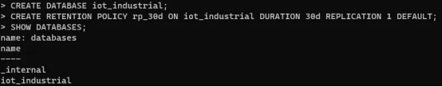
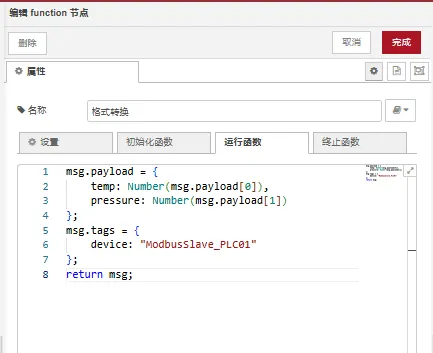
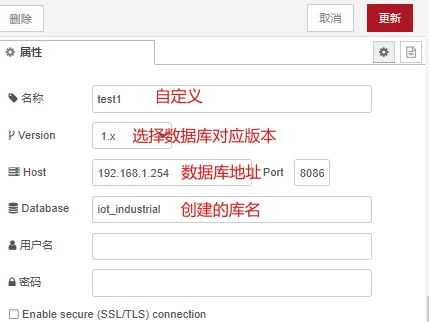
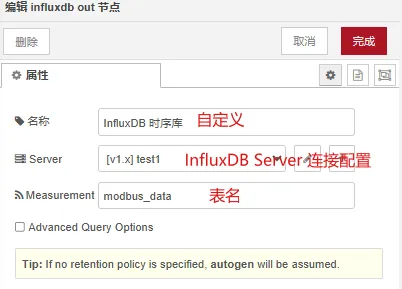
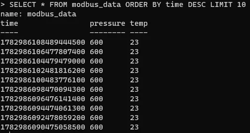
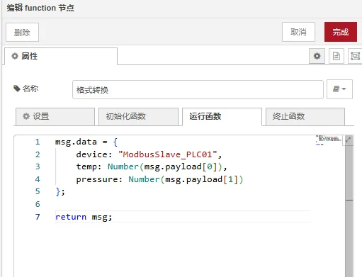
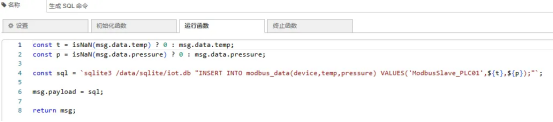
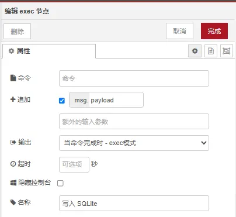
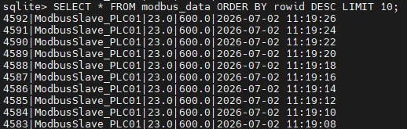

# Node-RED 双数据库存储实现

## 1. 项目简介

工业边缘采集场景中，InfluxDB 擅长时序实时分析，SQLite 擅长本地离线存储。单一数据库无法兼顾“实时监控 + 断网保数据”。

本文基于 ARMxy + Node-RED 搭建——采集、双写入双数据库架构：

1. InfluxDB：高频时序存储、实时查询、监控分析
2. SQLite：本地持久化、断网缓存、数据不丢失

本教程使用Modbus Slave 软件模拟 PLC/Modbus 从站设备，提供仿真温度、压力寄存器数据，无需真实工业硬件即可完整调试整套双库存储流程。

## 2. 系统架构

### 2.1 架构流程


### 2.2 数据流模式

一次采集、一次解析、双库同时落库，降低设备与网络开销。

```
Modbus采集 → Node-RED解析                  
├─ InfluxDB 实时时序存储                  
└─ SQLite 本地备份存储
```

## 3. InfluxDB 环境初始化

### 3.1 进入 InfluxDB 客户端创建数据库与保留策略

依次执行以下SQL：

```
CREATE DATABASE iot_industrial;                  
CREATE RETENTION POLICY rp_30d ON iot_industrial DURATION 30d REPLICATION 1 DEFAULT;                  
SHOW DATABASES;
```

### 3.2 验证标准



返回结果中能看到iot_industrial库即为创建成功。

## 4.InfluxDB 实时时序存储实现

节点管理安装node-red-contrib-influxdb

### 4.1 Node-RED 节点链路

modbus-read → function 数据处理 → influxdb out

### 4.2 数据转换节点配置



### 4.3influxdb out 节点配置





数据库：iot_industrial；数据表：modbus_data；设备标签：device；指标字段：temp（温度）、pressure（压力）。

### 4.4 数据查询验证

```
SELECT * FROM modbus_data ORDER BY time DESC LIMIT 10
```



## 5.SQLite 本地离线存储实现

环境兼容说明:

由于版本问题，官方node-red-node-sqlite3安装后节点无法正常使用。使用系统sqlite3 CLI 命令写入。

### 5.1步骤 1：ARMxy安装sqlite3工具

登录ARMxy终端执行：

```                  
apt-get update
apt-getinstall sqlite3 -y
#验证安装
sqlite3 --version
```

输出版本号代表安装完成。

### 5.2步骤 2：创建数据库目录与数据表

```                   
# 创建存储目录
mkdir-p /data/sqlite
# 进入数据库
sqlite3 /data/sqlite/iot.db
#数据库文件授权
chmod 777 /data/sqlite
```

库内执行建表语句：

```
CREATE TABLE modbus_data (                  
    id INTEGER PRIMARY KEY AUTOINCREMENT,                  
    device TEXT,                  
    temp REAL,                  
    pressure REAL,                  
    ts DATETIME DEFAULT CURRENT_TIMESTAMP                  
);
```

### 5.4 Node-RED 处理逻辑

格式转换节点



SQL命令生成节点



 此节点把上一步准备好的结构化数据拼装成一条完整的sqlite3 命令行

Exec 节点配置



命令（command）设为空：不预先指定任何程序，而是直接把msg.payload作为完整的命令执行。

追加（addpay）设为payload：启用该选项后，节点会把msg.payload的内容拼接到命令后面；由于command为空，最终执行的就是我们生成的 sqlite3... 语句

```                
# 进入数据库交互模式
sqlite3 /data/sqlite/iot.db
# 查看最新 10 条记录
SELECT * FROM modbus_data ORDER BY rowid DESC LIMIT 10;
```



| 维度 | InfluxDB | SQLite |
| --- | --- | --- |
| 类型 | 时序数据库 | 轻量关系型数据库 |
| 核心用途 | 实时分析、时序监控 | 本地存储、断网缓存 |
| 性能 | 高（适配高频采集） | 中（适配持久化备份） |
| 断网能力 | 不支持 | 支持 |

## 6. 双数据库对比

## 7. 方案优势

InfluxDB 实现实时数据监控与时序分析；SQLite 保障断网数据不丢失；双库冗余，提升边缘计算稳定性；适配工业现场弱网、离线场景

## 8. 总结

Node-RED + ARMxy + 双数据库 = 工业边缘数据可靠存储最小闭环方案，兼顾实时性与可靠性，适合快速落地工业物联网采集项目。

```
[
    {
        "id": "9b793cd80dec28ec",
        "type": "influxdb out",
        "z": "856d5bf8af2c53d2",
        "influxdb": "eb9e16ed1c1a13c9",
        "name": "InfluxDB 时序库",
        "measurement": "modbus_data",
        "precision": "",
        "retentionPolicy": "",
        "database": "iot_industrial",
        "precisionV18FluxV20": "ms",
        "retentionPolicyV18Flux": "",
        "org": "organisation",
        "bucket": "bucket",
        "x": 540,
        "y": 1020,
        "wires": []
    },
    {
        "id": "36daf7a1ce846119",
        "type": "modbus-read",
        "z": "856d5bf8af2c53d2",
        "name": "",
        "topic": "",
        "showStatusActivities": false,
        "logIOActivities": false,

"showErrors": false,
        "showWarnings": true,
        "unitid": "1",
        "dataType": "HoldingRegister",
        "adr": "0",
        "quantity": "2",
        "rate": "2000",
        "rateUnit": "ms",
        "delayOnStart": false,
        "startDelayTime": "",
        "server": "7ea55d2e2528af10",
        "useIOFile": false,
        "ioFile": "",
        "useIOForPayload": false,
        "emptyMsgOnFail": false,
        "x": 130,
        "y": 1060,
        "wires": [
            [
                "fn2-new",
                "174dca09b2017f07"
            ],
            []
        ]
    },
    {
        "id": "exec-new",
        "type": "exec",
        "z": "856d5bf8af2c53d2",
        "command": "",
        "addpay": "payload",
        "append": "",
        "useSpawn": "false",
        "timer": "",
        "winHide": false,
        "oldrc": false,
        "name": "写入 SQLite",
        "x": 690,
        "y": 1100,
        "wires": [
            [],

[],
            []
        ]
    },
    {
        "id": "fn2-new",
        "type": "function",
        "z": "856d5bf8af2c53d2",
        "name": "格式转换",
        "func": "msg.data = {\n    device: \"ModbusSlave_PLC01\",\n    temp: Number(msg.payload[0]),\n    pressure: Number(msg.payload[1])\n};\n\nreturn msg;",
        "outputs": 1,
        "timeout": 0,
        "noerr": 0,
        "initialize": "",
        "finalize": "",
        "libs": [],
        "x": 320,
        "y": 1100,
        "wires": [
            [
                "fn3-new"
            ]
        ]
    },
    {
        "id": "fn3-new",
        "type": "function",
        "z": "856d5bf8af2c53d2",
        "name": "生成 SQL 命令",
        "func": "const t = isNaN(msg.data.temp) ? 0 : msg.data.temp;\nconst p = isNaN(msg.data.pressure) ? 0 : msg.data.pressure;\n\nconst sql = `sqlite3 /data/sqlite/iot.db \"INSERT INTO modbus_data(device,temp,pressure) VALUES('ModbusSlave_PLC01',${t},${p});\"`;\n\nmsg.payload = sql;\n\nreturn msg;",
        "outputs": 1,
        "timeout": 0,
        "noerr": 0,
        "initialize": "",
        "finalize": "",
        "libs": [],
        "x": 500,

"y": 1100,
        "wires": [
            [
                "exec-new"
            ]
        ]
    },
    {
        "id": "174dca09b2017f07",
        "type": "function",
        "z": "856d5bf8af2c53d2",
        "name": "转换",
        "func": "msg.payload = {\n    temp: Number(msg.payload[0]),\n    pressure: Number(msg.payload[1])\n};\nmsg.tags = {\n    device: \"ModbusSlave_PLC01\"\n};\nreturn msg;",
        "outputs": 1,
        "timeout": 0,
        "noerr": 0,
        "initialize": "",
        "finalize": "",
        "libs": [],
        "x": 310,
        "y": 1020,
        "wires": [
            [
                "9b793cd80dec28ec"
            ]
        ]
    },
    {
        "id": "eb9e16ed1c1a13c9",
        "type": "influxdb",
        "hostname": "192.168.1.254",
        "port": "8086",
        "protocol": "http",
        "database": "iot_industrial",
        "name": "test1",
        "usetls": false,
        "tls": "",
        "influxdbVersion": "1.x",
        "url": "http://192.168.1.254:8086",
        "timeout": "10",

"rejectUnauthorized": false
    },
    {
        "id": "7ea55d2e2528af10",
        "type": "modbus-client",
        "name": "modbus slave",
        "clienttype": "tcp",
        "bufferCommands": true,
        "stateLogEnabled": false,
        "queueLogEnabled": false,
        "failureLogEnabled": true,
        "tcpHost": "192.168.1.254",
        "tcpPort": "502",
        "tcpType": "DEFAULT",
        "serialPort": "/dev/ttyUSB",
        "serialType": "RTU-BUFFERD",
        "serialBaudrate": "9600",
        "serialDatabits": "8",
        "serialStopbits": "1",
        "serialParity": "none",
        "serialConnectionDelay": "100",
        "serialAsciiResponseStartDelimiter": "0x3A",
        "unit_id": 1,
        "commandDelay": 1,
        "clientTimeout": 1000,
        "reconnectOnTimeout": true,
        "reconnectTimeout": 2000,
        "parallelUnitIdsAllowed": true,
        "showErrors": false,
        "showWarnings": true,
        "showLogs": true
    }
]
```

## 售后支持: 0755-29451836
