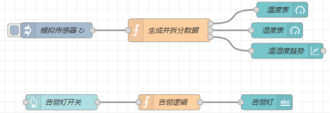
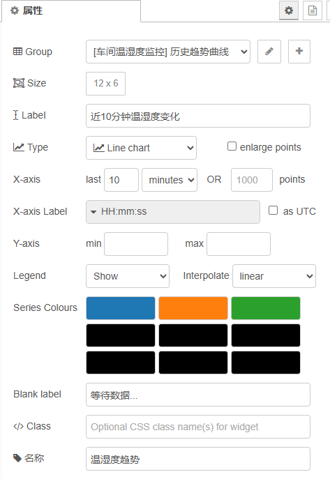
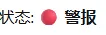
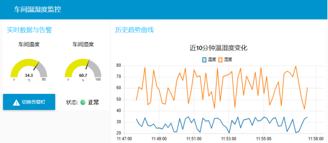

# Node-RED Dashboard 可视化数据看板实现

## 简介  
本教程利用Node-RED Dashboard 搭建一个具备实时数据展示、历史趋势追踪、交互控制的完整物联网看板。  

## 1. 安装 Dashboard 可视化插件  
Node-RED  默认不包含仪表盘控件，需要先安装官方插件，在 节点管理搜索 node-red-dashboard  进行安装  

## 2. 核心基础：Dashboard 三层 UI 结构  
Node-RED Dashboard  页面严格遵循三级层级，从上到下依次嵌套，所有可视化控件必须放在对应层级内才能显示。  
层级关系：Tab 标签页 → Group 分组 → Widget 控件  

- **Tab （标签页）**：看板最外层页面，一个  Tab  对应一个独立看板页面  
- **Group （分组）**：页面内的模块区块，用于归类同类功能控件，方便排版布局  
- **Widget （控件）**：最基础的可视化 / 交互组件（仪表盘、曲线、按钮、文字）  
Tab  和 Group  在控件里面进行配置  

## 3. 常用可视化控件快速认知  
本项目用到  4  个常用核心控件：  


### Gauge 仪表盘：

- **Group**：绑定所属分组，决定控件在看板哪个区块显示  
- **Size**：控件宽高网格尺寸  
- **Type**：仪表盘样式（半圆  /  环形  /  罗盘）  
- **Label**：仪表盘顶部标题  
- **Value format**：数值渲染模板， {{value}} 接收数据  
- **Units**：数值后缀单位（℃ /% ）  
- **Range min/max**：仪表盘刻度量程上下限  
- **Colour gradient**：正常  /  预警  /  超限三色  
- **Sectors**：两段阈值，划分三色区间  
- **Name**：编辑器节点备注名称  


### Chart 趋势图：

- **Type**：图表类型， Line chart  折线图； enlarge points  放大数据点  
- **X-axis**：横轴数据留存时长  /  点数，自动清理过期数据  
- **X-axis Label**：横轴时间格式, as UTC 切换时区  
- **Y-axis min/ max**：纵轴数值量程, 留空自动适配  
- **Legend**：是否显示曲线图例  
- **Interpolate**：曲线插值平滑方式  
- **Series Colours**：多条曲线自动分配的配色  
- **Blank label**：无数据时展示的提示文字  


### Text 文本控件:

- **Value format**：数据渲染模板, {{msg.payload}}读取消息负载显示内容  
- **Layout**：标题与数值的排版布局(左右并排/上下堆叠/居中)  
- **Style**：Apply Style 开启后可自定义文字颜色、字号等样式  
- **Class**：自定义 CSS样式类，进阶美化控件  


### Button 按钮控件:

- **Icon**：按钮前置图标，填写图标名称即可显示  
- **Tooltip**：鼠标悬浮按钮时弹出的提示文字  
- **Color/ Background**：分别设置按钮文字图标颜色、按钮背景色  
- **Payload**：点击按钮时向下游输出的消息负载内容  
- **Topic**：点击按钮时输出消息的 topic 主题标识  
- **If msg arrives on input, emulate a button click**：勾选后上游收到消息将自动模拟点击按钮  
- **Class**：自定义 CSS样式类，用于进阶美化  

## 4. 项目实战：搭建车间温湿度监控看板  

### 4.1 架构流程  



### 4.3 节点分步配置讲解  

#### 4.3.1 模拟传感器 (Inject节点)  


自动触发数据采集，模拟传感器 10 秒上报一次数据，无需手动触发。真实项目中可直接替换为 MQTT/Modbus 传感器采集节点。

#### 4.3.2 生成并拆分数据 (Function节点)  
自动生成 20~35℃车间温度、40%~80%车间湿度的随机模拟数据。同时拆分三路数据输出，分别供仪表盘、趋势图使用。  

```
//1.模拟生成温湿度数据
const temp=parseFloat((Math.random()*15+20).toFixed(1));
//20~35℃
const humi= parseFloat((Math.random()*40+40).toFixed(1));
//40~80%
var msg_temp= {payload: temp, topic:"温度"};
var msg_humi= {payload: humi, topic:"湿度"};
return[msg_temp, msg_humi,[msg_temp, msg_humi]];
```

#### 4.3.3 温湿度仪表盘 (Gauge)

- **温度表盘**: 量程0~50℃, ≤25℃绿色正常、25~35℃黄色预警、>35℃红色超限  
- **湿度表盘**: 量程0~100%, ≤40%绿色正常、40~70%黄色预警、>70%红色超限  

#### 4.3.4 温湿度趋势图 (Chart)



自动记录近 10分钟温湿度数据，生成双曲线折线图，时间轴精确到时分秒，自动清理过期数据，界面直观展示数据波动趋势。  

#### 4.3.5 告警灯开关(Button)


每次点击按钮，会向下游告警逻辑 Function节点发送一条完整消息：  

#### 4.3.6 告警逻辑处理 (Function)
通过流程变量缓存告警状态，点击按钮自动翻转状态，分别输出红色警报、绿色正常状态信息。  

```
let isAlarmOn = flow.get('isAlarmOn') || false;
isAlarmOn = !isAlarmOn;
flow.set('isAlarmOn', isAlarmOn);
if(isAlarmOn) {
    msg.payload = "警报";
    msg.color = "red";
} else {
    msg.payload = "正常";
    msg.color = "green";
}
return msg;
```

#### 4.3.7 告警状态展示 (Text)
实时渲染告警状态文字，居中展示，直观查看车间告警状态。  

**效果展示**：  




### 4.4 页面布局结构  



- **主标签页**：车间温湿度监控  
- **分组1 (实时数据与告警)**：温度表盘、湿度表盘、告警按钮、状态文本  
- **分组2 (历史趋势曲线)**：温湿度历史折线图  

## 5. 看板访问与多终端适配  

### 5.1 访问地址  
部署成功后，浏览器打开地址：  
`http://设备IP:1880/ui`  
示例：设备局域网 IP  为  192.168.1.100 ，则访问： `http://192.168.1.100/ui`  

### 5.2 自适应特性  
看板自带响应式布局，无需额外开发，自动适配 电脑、平板、手机 所有终端设备。  

```json
[
    {
        "id": "f32f05f12df272db",
        "type": "inject",
        "z": "7e8973429d00dbe0",
        "name": " 模拟传感器 ",
        "props": [
            {
                "p": "payload"
            }
        ],
        "repeat": "10",
        "crontab": "",
        "once": true,
        "onceDelay": 0.1,
        "topic": "",
        "payload": "",
        "payloadType": "date",
        "x": 120,
        "y": 120,
        "wires": [
            [
                "6363e9e60ba7eef4"
            ]
        ]
    },
    {
        "id": "6363e9e60ba7eef4",
        "type": "function",
        "z": "7e8973429d00dbe0",
        "name": " 生成温湿度数据 ",
        "func": "//1.模拟生成温湿度数据\nconst temp=parseFloat((Math.random()*15+20).toFixed(1));\n//20~35℃\nconst humi= parseFloat((Math.random()*40+40).toFixed(1));\n//40~80%\nvar msg_temp= {payload: temp, topic:\"温度\"};\nvar msg_humi= {payload: humi, topic:\"湿度\"};\nreturn[msg_temp, msg_humi,[msg_temp, msg_humi]];",
        "outputs": 3,
        "noerr": 0,
        "initialize": "",
        "finalize": "",
        "libs": [],
        "x": 340,
        "y": 120,
        "wires": [
            [
                "a3d5b5e8c7f1a2b3"
            ],
            [
                "b4e6c7d8e9f0a1b2"
            ],
            [
                "d61637279ce20149"
            ]
        ]
    },
    {
        "id": "a3d5b5e8c7f1a2b3",
        "type": "ui_gauge",
        "z": "7e8973429d00dbe0",
        "name": " 温度表 ",
        "group": "84282b608648b0b0",
        "order": 1,
        "width": "3",
        "height": "3",
        "gtype": "gage",
        "title": " 车间温度 ",
        "label": "°C",
        "format": "{{value}}",
        "min": 0,
        "max": "50",
        "colors": [
            "#00b500",
            "#e6e600",
            "#ca3838"
        ],
        "seg1": "25",
        "seg2": "35",
        "diff": false,
        "className": "",
        "x": 560,
        "y": 80,
        "wires": []
    },
    {
        "id": "b4e6c7d8e9f0a1b2",
        "type": "ui_gauge",
        "z": "7e8973429d00dbe0",
        "name": " 湿度表 ",
        "group": "84282b608648b0b0",
        "order": 2,
        "width": "3",
        "height": "3",
        "gtype": "gage",
        "title": " 车间湿度 ",
        "label": "%",
        "format": "{{value}}",
        "min": 0,
        "max": "100",
        "colors": [
            "#00b500",
            "#e6e600",
            "#ca3838"
        ],
        "seg1": "40",
        "seg2": "70",
        "x": 550,
        "y": 120,
        "wires": []
    },
    {
        "id": "d61637279ce20149",
        "type": "ui_chart",
        "z": "7e8973429d00dbe0",
        "name": " 温湿度趋势 ",
        "group": "84d42c8c2cc3e7cf",
        "order": 1,
        "width": "12",
        "height": "6",
        "label": " 近 10 分钟温湿度变化 ",
        "chartType": "line",
        "legend": "true",
        "xformat": "HH:mm:ss",
        "interpolate": "linear",
        "nodata": " 等待数据 ...",
        "dot": false,
        "ymin": "",
        "ymax": "",
        "removeOlder": "10",
        "removeOlderPoints": "",
        "removeOlderUnit": "60",
        "cutout": 0,
        "useOneColor": false,
        "useUTC": false,
        "colors": [
            "#1f77b4",
            "#ff7f0e",
            "#2ca02c",
            "#000000",
            "#000000",
            "#000000",
            "#000000",
            "#000000",
            "#000000"
        ],
        "outputs": 1,
        "useDifferentColor": false,
        "className": "",
        "x": 570,
        "y": 160,
        "wires": [
            []
        ]
    },
    {
        "id": "7b218a136044af6c",
        "type": "ui_button",
        "z": "7e8973429d00dbe0",
        "name": " 告警灯开关 ",
        "group": "84282b608648b0b0",
        "order": 3,
        "width": "3",
        "height": "1",
        "passthru": false,
        "label": " 切换告警灯 ",
        "tooltip": "",
        "color": "",
        "bgcolor": "",
        "className": "",
        "icon": "warning",
        "payload": "toggle",
        "payloadType": "str",
        "topic": "alarm_toggle",
        "topicType": "str",
        "x": 130,
        "y": 260,
        "wires": [
            [
                "e8f9a0b1c2d3e4f5"
            ]
        ]
    },
    {
        "id": "e8f9a0b1c2d3e4f5",
        "type": "function",
        "z": "7e8973429d00dbe0",
        "name": " 告警逻辑处理 ",
        "func": "let isAlarmOn = flow.get('isAlarmOn') || false;\nisAlarmOn = !isAlarmOn;\nflow.set('isAlarmOn', isAlarmOn);\nif(isAlarmOn) {\n    msg.payload = \"警报\";\n    msg.color = \"red\";\n} else {\n    msg.payload = \"正常\";\n    msg.color = \"green\";\n}\nreturn msg;",
        "outputs": 1,
        "noerr": 0,
        "initialize": "",
        "finalize": "",
        "libs": [],
        "x": 350,
        "y": 260,
        "wires": [
            [
                "f0a1b2c3d4e5f6g7"
            ]
        ]
    },
    {
        "id": "f0a1b2c3d4e5f6g7",
        "type": "ui_text",
        "z": "7e8973429d00dbe0",
        "group": "84282b608648b0b0",
        "order": 4,
        "width": "3",
        "height": "1",
        "name": " 告警状态展示 ",
        "label": "",
        "format": "{{msg.payload}}",
        "layout": "row-center",
        "className": "",
        "style": false,
        "font": "",
        "fontSize": "",
        "color": "#000000",
        "x": 530,
        "y": 260,
        "wires": []
    },
    {
        "id": "84282b608648b0b0",
        "type": "ui_group",
        "name": " 实时数据与告警 ",
        "tab": "9a361410c48a48a3",
        "order": 1,
        "disp": true,
        "width": "6",
        "collapse": false
    },
    {
        "id": "84d42c8c2cc3e7cf",
        "type": "ui_group",
        "name": " 历史趋势曲线 ",
        "tab": "9a361410c48a48a3",
        "order": 2,
        "disp": true,
        "width": "12",
        "collapse": false
    },
    {
        "id": "9a361410c48a48a3",
        "type": "ui_tab",
        "name": " 车间温湿度监控 ",
        "icon": "dashboard",
        "disabled": false,
        "hidden": false
    }
]
```

## 售后支持：0755-29451836
